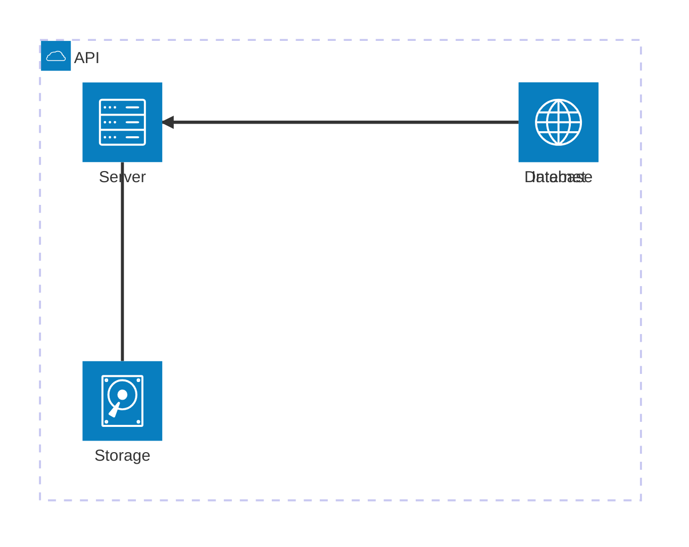
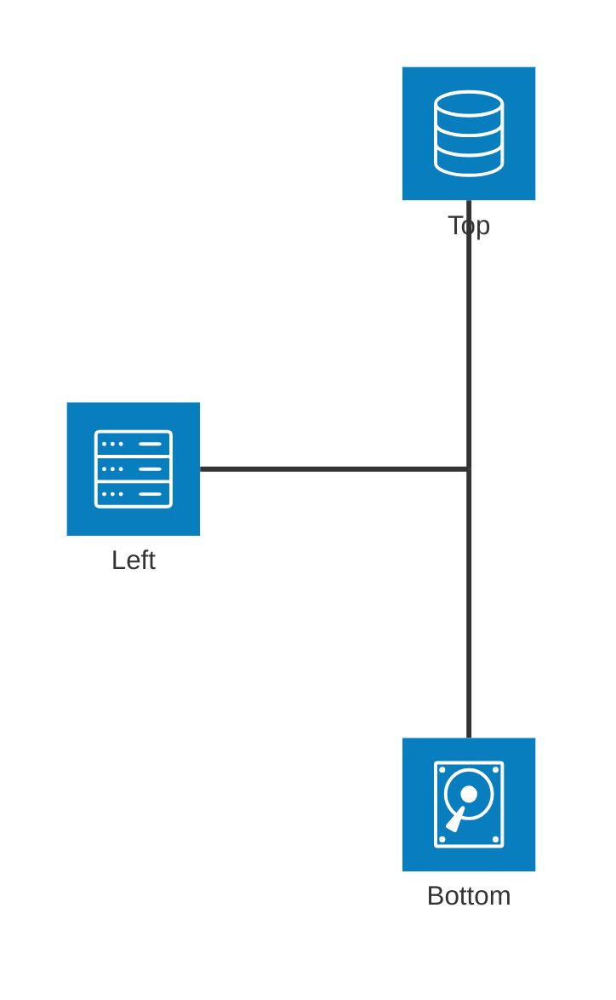

# アーキテクチャ図の例

```mermaid
architecture-beta
    group api(cloud)[API]
    service db(database)[Database] in api
    service disk1(disk)[Storage] in api
    service server(server)[Server] in api
    service internet(internet)[Internet]
    db:L -- R:server
    disk1:T -- B:server
    internet:L --> R:server
```

サービスのアイコンとラベルはOfficeグループとしてコピーされます。グループのまま移動でき、解除すればアイコンの部品や文字を編集できます。

ジャンクションの例です。

```mermaid
architecture-beta
    service left(server)[Left]
    service top(database)[Top]
    service bottom(disk)[Bottom]
    junction junctionCenter
    left:R -- L:junctionCenter
    top:B -- T:junctionCenter
    bottom:T -- B:junctionCenter
```
