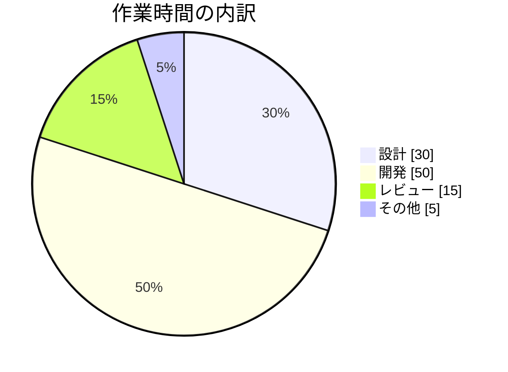

# パイチャートの例

```mermaid
pie showData
    title 作業時間の内訳
    "設計" : 30
    "開発" : 50
    "レビュー" : 15
    "その他" : 5
```

図を右クリックし「PowerPoint図」を選びます。各扇形、凡例の色見本、文字を個別に編集できます。
これはOffice図形としてのコピーで、PowerPointのデータ編集可能なチャートではありません。
