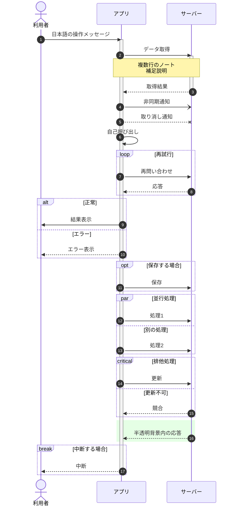

# シーケンス図のPowerPointコピー例

```mermaid
sequenceDiagram
    autonumber
    actor U as 利用者
    participant A as アプリ
    participant S as サーバー
    U->>A: 日本語の操作メッセージ
    activate A
    A->>S: データ取得
    activate S
    Note over A,S: 複数行のノート<br/>補足説明
    S-->>A: 取得結果
    deactivate S
    A-)S: 非同期通知
    A--xS: 取り消し通知
    A->>A: 自己呼び出し
    loop 再試行
        A->>S: 再問い合わせ
        S-->>A: 応答
    end
    alt 正常
        A->>U: 結果表示
    else エラー
        A-->>U: エラー表示
    end
    opt 保存する場合
        A->>S: 保存
    end
    par 並行処理
        A->>S: 処理1
    and 別の処理
        A->>S: 処理2
    end
    critical 排他処理
        A->>S: 更新
    option 更新不可
        S-->>A: 競合
    end
    rect rgba(0, 255, 0, 0.1)
        S-->>A: 半透明背景内の応答
    end
    break 中断する場合
        A-->>U: 中断
    end
    deactivate A
```
