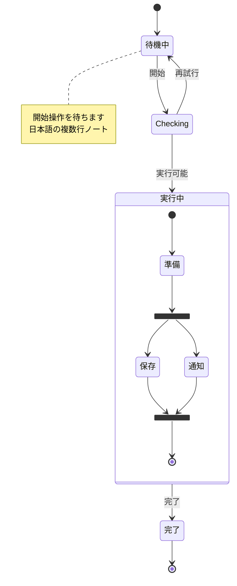
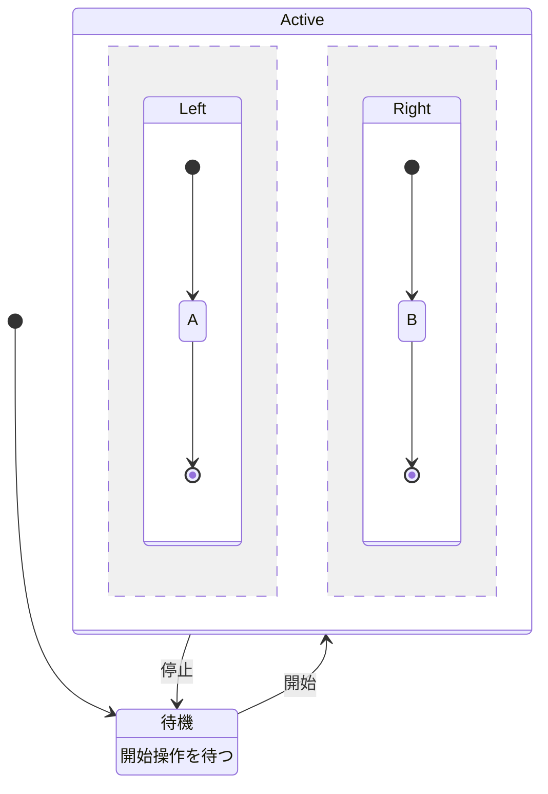

# 状態図の例

以下のコードブロックを文書へ貼り付け、図を右クリックして「PowerPoint図」でコピーできます。
`stateDiagram` と `stateDiagram-v2` はどちらも標準の dagre-wrapper レンダラーで描画します。

```mermaid
stateDiagram-v2
    direction TB
    [*] --> Waiting
    state "待機中" as Waiting
    Waiting --> Checking : 開始
    state Checking <<choice>>
    Checking --> Running : 実行可能
    Checking --> Waiting : 再試行
    state "実行中" as Running {
        [*] --> Prepare
        state "準備" as Prepare
        state Split <<fork>>
        state Merge <<join>>
        Prepare --> Split
        Split --> Save
        Split --> Notify
        state "保存" as Save
        state "通知" as Notify
        Save --> Merge
        Notify --> Merge
        Merge --> [*]
    }
    note right of Waiting
        開始操作を待ちます
        日本語の複数行ノート
    end note
    Running --> Finished : 完了
    state "完了" as Finished
    Finished --> [*]
```

並行状態と説明欄の例です。

```mermaid
stateDiagram
    state Active {
        state Left {
            [*] --> A
            A --> [*]
        }
        --
        state Right {
            [*] --> B
            B --> [*]
        }
    }
    Idle : 待機
    Idle : 開始操作を待つ
    [*] --> Idle
    Idle --> Active : 開始
    Active --> Idle : 停止
```
